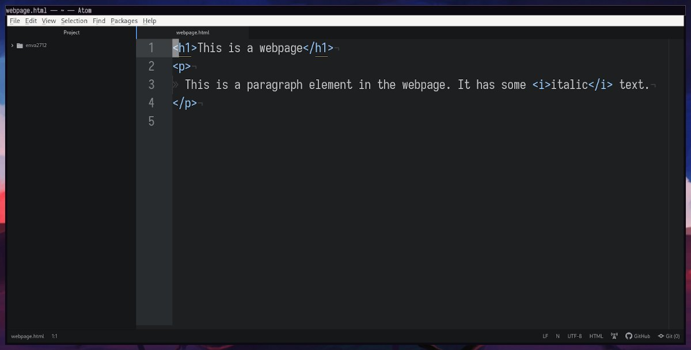
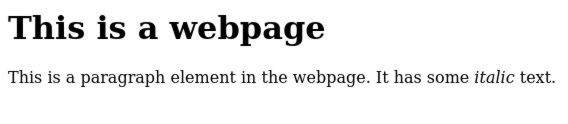

# Basic HTML Tags

Content in HTML is described with tags. A tag is a bit of text inside angle brackets (`<` and `>`) that describes it's content. Tags look like `<tag>content</tag>`. A tag can either be opening or closing; and closing tags have a slash before the name to tell them apart. Tags are used to mark where an element begins and ends. In the example above, the first tag starts a `tag` element, and the second one ends it. HTML defines a number of elements, such as `h1` for heading 1, `p` for paragraph, and `a` for anchor (link). There are many more, but with these three you can begin to create simple web pages.

## Simple Webpage

Open Atom and press `ctrl`-`n` to create a new tab. In this tab, create some HTML elements by opening a tag, typing some content, then closing the tag. Next, press `ctrl`-`s`, and save the file as `webpage.html` on your desktop.

Next, find the file and open it with your web browser (if you saved it to your desktop, you can just double click it). After saving the file, you can refresh your browser to see the updates. As new concepts are introduced, it is a good idea to play around with them in this file to get a hang of how they work.


## Attributes

An element can also describe itself with attributes. An attribute is just a bit of data in an element's opening tag. For example, to create a link using the `a` element, we need to provide a URL in the `href` attribute (Shortened version of Hypertext Reference):

```html
<a href="http://example.com">This is a link</a>
```

This shows up as "<a href="http://example.com">This is a link</a>." If we had just opened the element with `<a>`, the browser wouldn't have known where the link was pointing. For example, <a>This link has no href attribute</a>.

An element can have any attribute with any value, but only a few will be used by the browser. Some attributes like `href` only have meaning for a few elements, while others like `style` can be used on any element. We will cover the style attribute in more depth in the next lesson.

# Reference

* Tags are used to describe content.
* An element consists of an opening tag, content, and a closing tag.
* Content can be a mixture of plain text and elements.
* An opening tag can have attributes after the tag name
* A tag or attribute can have any name, but only a few have meaning to the browser

```html
<h1>
    This is a header 1 element. It is the largest header.
</h1>
<h2>This is a header 2 element.</h2>
<h3>There are 6 header sizes; h1-h6</h3>
<p>
    White space is collapsed.
    That means that in a browser
    <mark>this element</mark>
    will look the same as
    <mark>
        this
        element
    </mark>.
</p>

<p>
    Elements can have attributes in the opening tag.
    Attributes look like name="value"
    In a link element, the href attribute holds the URL
    <a href="http://example.com/">
        This is the link text.
        This is a link to example.com
    </a>
</p>
```
